# [pudzu-charts](pudzu/charts/charts.py)

## Summary 
Pillow-based charting.
 
## Dependencies
*Required*: [pandas](http://pandas.pydata.org/), [pudzu-pillar](../pudzu-pillar/README.md), [pudzu-dates](../pudzu-dates/README.md).

## Documentation

Five chart types are currently supported: **bar charts**, **time charts**, **grid charts**, **map charts** and **calendar charts**. For usage information, see the docstrings or [sample scripts](https://github.com/Udzu/pudzu/).

### Legends

**generate_legend**: generate a chart category legend.

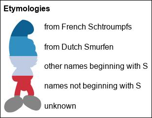

### Bar charts

**bar_chart**: generate a bar chart; supports grouped, stacked and percentage stacked charts, as well as horizontal charts and flexible coloring and labeling.

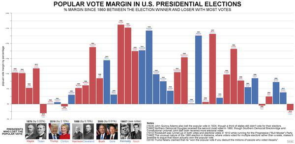

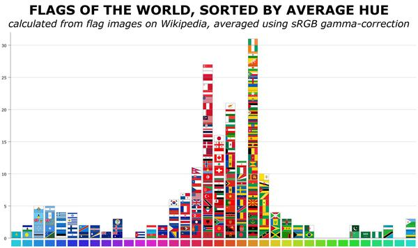

### Line charts

**line_chart**: generate a line chart; supports stacked and overlayed area charts, as well as flexible coloring and labeling. Requires matplotlib.

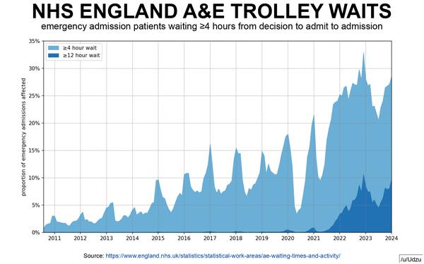

### Time charts

**time_chart**: generate a time chart; supports numeric and date timelines highlighting both ranges and events.

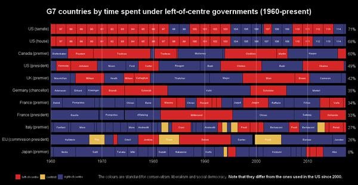

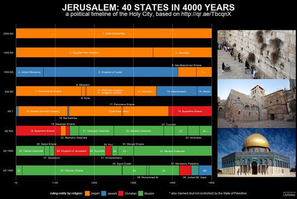

### Grid charts

**grid_chart**: generate an image grid chart; supports grouping cells to generate Euler diagrams.

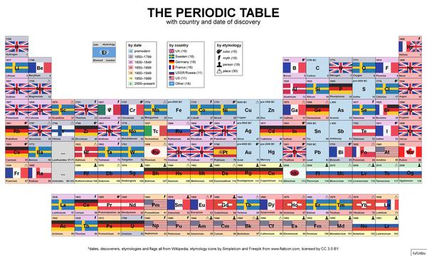

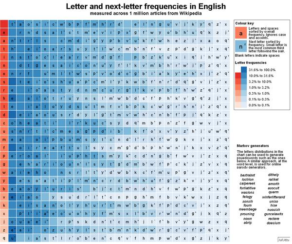

### Map charts

**map_chart**: generate a map chart. Input is a map template with each region having a unique color. Regions can be named (see generate_name_csv), labelled (see generate_bbox_csv) and have overlays such as label arrows.

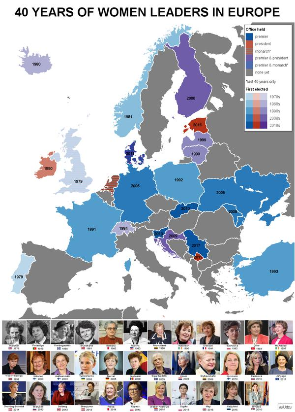

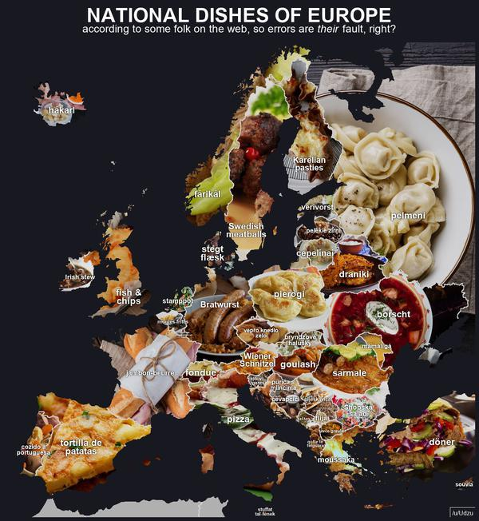

### Calendar charts

**month_chart**: generate a calendar chart for a given month; supports non-Western calendars.

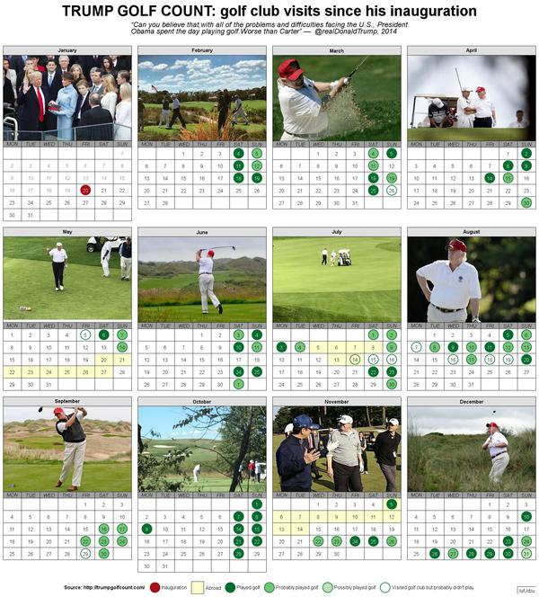
